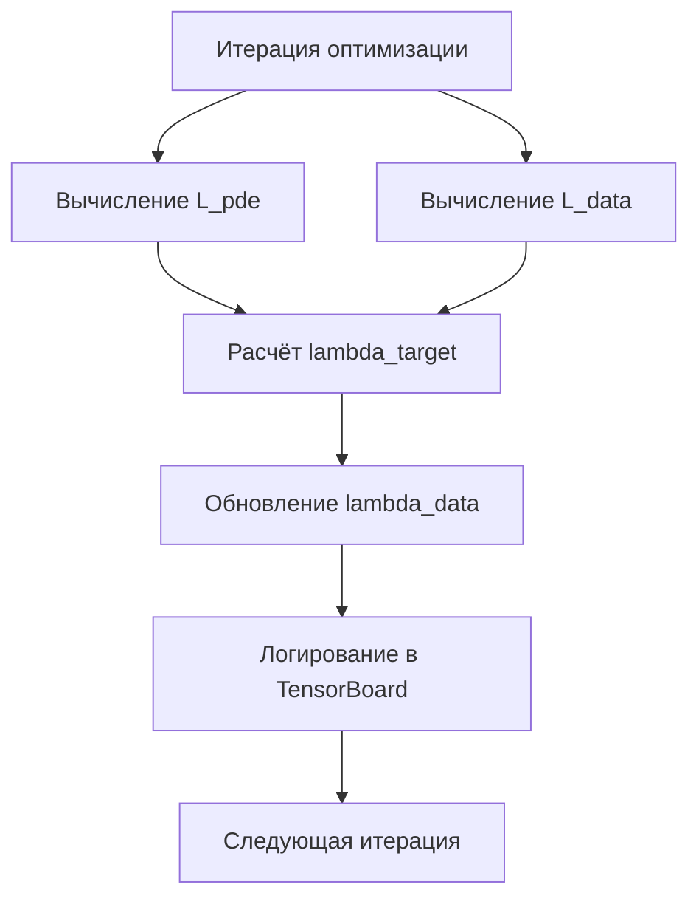

# План: Адаптивный баланс lambda_data

## Цель

Реализовать автоматическую настройку веса `lambda_data` так, чтобы поддерживать соотношение:

```
L_data ≈ alpha_data * L_pde
```

где `alpha_data` — целевое соотношение между data loss и PDE loss.

## Математика

### Формула обновления

На каждой итерации:

```julia
# Вычисляем текущие потери
L_pde = sum(pde_losses)
L_data = data_loss / lambda_data  # "Сырое" значение без веса

# Целевое значение lambda_data
lambda_target = alpha_data * L_pde / L_data

# Плавное обновление (экспоненциальное сглаживание)
lambda_data_new = lambda_data * (lambda_target / lambda_data)^beta
```

где:
- `beta` — скорость адаптации (0.1-0.5), меньше = плавнее
- `alpha_data` — целевое соотношение (0.1-1.0), сколько веса давать данным относительно PDE

### Защита от численной нестабильности

```julia
# Ограничения на lambda_data
lambda_data_new = clamp(lambda_data_new, lambda_min, lambda_max)
```

## Архитектура



## Изменения в коде

### 1. LossFunctionConfig (Optimization.jl)

```julia
struct LossFunctionConfig
    lambda_pde::Float64
    lambda_bc::Float64
    lambda_data::Float64      # Начальное значение
    alpha_data::Float64       # Целевое соотношение L_data/L_pde
    adaptive::Bool            # Включить адаптивный баланс
    beta::Float64             # Скорость адаптации
    lambda_min::Float64       # Минимальное значение lambda_data
    lambda_max::Float64       # Максимальное значение lambda_data
    measured_points::Vector
    
    function LossFunctionConfig(;
        lambda_pde=1.0,
        lambda_bc=1.0,
        lambda_data=10.0,
        alpha_data=1.0,       # L_data ≈ L_pde
        adaptive=true,
        beta=0.1,
        lambda_min=0.01,
        lambda_max=10000.0,
        measured_points=Vector{Any}[]
    )
        return new(lambda_pde, lambda_bc, lambda_data, alpha_data, 
                   adaptive, beta, lambda_min, lambda_max, measured_points)
    end
end
```

### 2. Mutable состояние для lambda_data

Нужна изменяемая переменная внутри callback:

```julia
function create_optimization_callback(...)
    # Mutable состояние
    lambda_data_ref = Ref{Float64}(loss_config.lambda_data)
    
    return function (p, l)
        # ... вычисление L_pde и L_data ...
        
        if loss_config.adaptive
            # Адаптивное обновление
            L_pde = sum(pde_losses)
            L_data_raw = data_loss / lambda_data_ref[]
            
            if L_data_raw > 1e-10  # Защита от деления на ноль
                lambda_target = loss_config.alpha_data * L_pde / L_data_raw
                lambda_data_ref[] = lambda_data_ref[] * 
                    (lambda_target / lambda_data_ref[])^loss_config.beta
                lambda_data_ref[] = clamp(lambda_data_ref[], 
                    loss_config.lambda_min, loss_config.lambda_max)
            end
        end
        
        # Логирование
        if logger !== nothing
            log_value(logger, "Loss/L_pde", L_pde; step=iter)
            log_value(logger, "Loss/L_data", L_data_raw; step=iter)
            log_value(logger, "Params/lambda_data", lambda_data_ref[]; step=iter)
        end
    end
end
```

### 3. Интеграция с additional_loss

Проблема: `additional_loss` не имеет доступа к PDE loss.

**Решение:** Передавать lambda_data через параметр `p` или использовать замыкание с Ref.

```julia
function create_additional_loss(loss_config::LossFunctionConfig, lambda_data_ref::Ref{Float64})
    function additional_loss(phi_pred_fun, θ, p_)
        result = sum(abs2(phi_pred_fun([x, y, z, t], θ)[1] - phi)
                    for (x, y, z, t, phi) in loss_config.measured_points) /
                    length(loss_config.measured_points)
        result = result * lambda_data_ref[]  # Используем текущее значение
        return result
    end
    return additional_loss
end
```

## Параметры по умолчанию

| Параметр | Значение | Описание |
|----------|----------|----------|
| `alpha_data` | 1.0 | L_data ≈ L_pde |
| `beta` | 0.1 | Плавное обновление |
| `lambda_min` | 0.01 | Минимум |
| `lambda_max` | 10000.0 | Максимум |
| `adaptive` | true | Включить адаптацию |

## Файлы для изменения

1. **`src/neural_pde_solver/Optimization.jl`**
   - Обновить `LossFunctionConfig`
   - Изменить `create_additional_loss` для использования Ref
   - Обновить `create_optimization_callback` для адаптации

2. **`src/neural_pde_solver/InverseProblem.jl`**
   - Передавать lambda_data_ref между функциями

3. **`src/inverse_npde/julia_interface.py`**
   - Добавить новые параметры в Python обёртку

## Тестирование

1. Запустить эксперимент с адаптивным балансом
2. Проверить логи TensorBoard:
   - L_pde и L_data должны быть сравнимы
   - lambda_data должен стабилизироваться
3. Сравнить с фиксированным lambda_data
