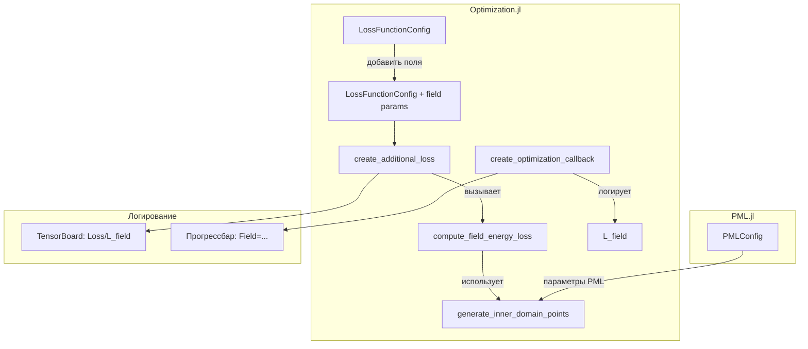

# План реализации регуляризации энергии поля L_field

## Обзор задачи

Проблема: обратная задача ЭЭГ плохо обусловлена, т.к. уменьшение PDE лосса может достигаться за счёт подгонки ρ и j без физически осмысленного решения.

Решение: добавить регуляризацию через функцию потерь энергии поля:

```
E_field = ∫ ρ·φ dV + ∫ (A·j) dV    # Энергия поля
L_field = exp(-E_field / scale)    # Экспоненциальный лосс
```

**Свойства экспоненциального лосса:**
- При E_field → +∞ (большая энергия): L_field → 0 (хорошее решение)
- При E_field → -∞ (отрицательная энергия): L_field → +∞ (плохое решение)
- При E_field = 0 (нет источников): L_field = 1 (промежуточное, не оптимальное)

Это избегает тривиального решения "нет источников", т.к. L_field = 1 не является минимумом.

## Параметры

| Параметр | Значение | Описание |
|----------|----------|----------|
| `lambda_field` | 1.0 | Вес регуляризации L_field |
| `num_field_samples` | 500 | Количество точек для Monte Carlo интегрирования |
| `field_energy_scale` | 3.0 | Масштабирующий коэффициент для exp(-E/scale) |

## Архитектура изменений



## Детали реализации

### 1. Расширение LossFunctionConfig

Добавить новые поля в структуру [`LossFunctionConfig`](src/neural_pde_solver/Optimization.jl:47):

```julia
struct LossFunctionConfig
    # ... существующие поля ...
    lambda_field::Float64              # Вес регуляризации энергии поля (default: 1.0)
    num_field_samples::Int             # Количество точек для интегрирования (default: 500)
    field_energy_scale::Float64        # Масштаб энергии для exp(-E/scale) (default: 3.0)
end
```

### 2. Функция generate_inner_domain_points

Создать функцию для генерации точек во внутренней области (домен минус PML область):

```julia
"""
    generate_inner_domain_points(domains, pml_config, num_points, t_value=nothing)

Генерирует случайные точки во внутренней области домена (исключая PML слой).

# Аргументы
- `domains`: Массив доменов для каждой переменной
- `pml_config`: Конфигурация PML с параметром pml_thickness_ratio
- `num_points`: Количество точек для генерации
- `t_value`: Значение времени для пространственной интеграции (nothing = случайное)

# Возвращает
- Matrix{Float32} размером [4, num_points] с координатами (x, y, z, t)
"""
function generate_inner_domain_points(domains, pml_config::PMLConfig, num_points::Int; t_value=nothing)
    # Получаем границы домена
    x_min, x_max = infimum(domains[1].domain), supremum(domains[1].domain)
    y_min, y_max = infimum(domains[2].domain), supremum(domains[2].domain)
    z_min, z_max = infimum(domains[3].domain), supremum(domains[3].domain)
    t_min, t_max = infimum(domains[4].domain), supremum(domains[4].domain)
    
    # Вычисляем толщину PML слоя
    Dx = (x_max - x_min) * pml_config.pml_thickness_ratio
    Dy = (y_max - y_min) * pml_config.pml_thickness_ratio
    Dz = (z_max - z_min) * pml_config.pml_thickness_ratio
    
    # Внутренние границы (без PML)
    x_inner_min, x_inner_max = x_min + Dx, x_max - Dx
    y_inner_min, y_inner_max = y_min + Dy, y_max - Dy
    z_inner_min, z_inner_max = z_min + Dz, z_max - Dz
    
    # Генерируем случайные точки во внутренней области
    points = zeros(Float32, 4, num_points)
    for i in 1:num_points
        points[1, i] = Float32(x_inner_min + (x_inner_max - x_inner_min) * rand())
        points[2, i] = Float32(y_inner_min + (y_inner_max - y_inner_min) * rand())
        points[3, i] = Float32(z_inner_min + (z_inner_max - z_inner_min) * rand())
        points[4, i] = t_value !== nothing ? Float32(t_value) : Float32(t_min + (t_max - t_min) * rand())
    end
    
    return points
end
```

### 3. Функция compute_field_energy_loss

```julia
"""
    compute_field_energy_loss(phi_pred_fun, θ, inner_points, lambda_field, energy_scale)

Вычисляет регуляризационный лосс энергии поля:
    E_field = ∫ ρ·φ dV + ∫ (A·j) dV    # Энергия поля
    L_field = exp(-E_field / scale)    # Экспоненциальный лосс

Использует Monte Carlo интегрирование по сгенерированным точкам внутренней области.

# Аргументы
- `phi_pred_fun`: Функция предсказания нейросети
- `θ`: Параметры нейросети
- `inner_points`: Точки внутренней области [4, N]
- `lambda_field`: Вес регуляризации
- `energy_scale`: Масштабирующий коэффициент для энергии

# Возвращает
- NamedTuple: (total=L_field, E_field=..., rho_phi=..., A_j=...)
"""
function compute_field_energy_loss(phi_pred_fun, θ, inner_points, lambda_field::Float64, energy_scale::Float64)
    dev = Lux.gpu_device()
    
    # Переносим данные на GPU
    points_gpu = inner_points |> dev
    θ_gpu = θ |> dev
    
    # Получаем предсказания сети: [φ, Ax, Ay, Az, ρ, jx, jy, jz]
    pred = phi_pred_fun(points_gpu, θ_gpu)
    
    # Извлекаем компоненты
    phi = pred[1, :]      # Скалярный потенциал
    Ax = pred[2, :]       # Компоненты векторного потенциала
    Ay = pred[3, :]
    Az = pred[4, :]
    rho = pred[5, :]      # Плотность заряда
    jx = pred[6, :]       # Компоненты плотности тока
    jy = pred[7, :]
    jz = pred[8, :]
    
    # Вычисляем энергию поля методом Monte Carlo
    # E_field = ∫ρφ dV + ∫(A·j) dV
    # Monte Carlo: ∫ f(x) dV ≈ V * mean(f(x_i))
    
    # Первый интеграл: ∫ ρ·φ dV
    rho_phi_term = mean(rho .* phi)
    
    # Второй интеграл: ∫ (A·j) dV = ∫ (Ax*jx + Ay*jy + Az*jz) dV
    A_dot_j = Ax .* jx .+ Ay .* jy .+ Az .* jz
    A_j_term = mean(A_dot_j)
    
    # Общая энергия поля
    E_field = rho_phi_term + A_j_term
    
    # Экспоненциальный лосс: L_field = exp(-E_field / scale)
    # При E_field → +∞: L_field → 0 (хорошее решение)
    # При E_field → -∞: L_field → +∞ (плохое решение)
    # При E_field = 0: L_field = 1 (промежуточное)
    L_field = exp(-E_field / energy_scale)
    
    return (total=L_field * lambda_field, E_field=E_field, rho_phi=rho_phi_term, A_j=A_j_term)
end
```

### 4. Интеграция в create_additional_loss

Модифицировать функцию [`create_additional_loss`](src/neural_pde_solver/Optimization.jl:301):

```julia
function create_additional_loss(loss_config::LossFunctionConfig, lambda_data_ref::Ref{Float64}, 
                               domains, pml_config::PMLConfig)
    # ... существующий код ...
    
    # Предгенерируем точки для интегрирования (фиксированные для стабильности градиентов)
    inner_points = generate_inner_domain_points(domains, pml_config, loss_config.num_field_samples)
    
    function additional_loss(phi_pred_fun, θ, p_)
        # ... существующий код для data loss ...
        
        # Вычисляем L_field
        field_loss = compute_field_energy_loss(phi_pred_fun, θ, inner_points, loss_config.lambda_field)
        
        # Объединяем все потери
        lambda_detached = Zygote.dropgrad(lambda_data_ref[])
        result = (mse + lambda_time * deriv_loss) * lambda_detached + field_loss.total
        
        return result
    end
    
    return additional_loss, inner_points
end
```

### 5. Обновление callback для логирования

Модифицировать [`create_optimization_callback`](src/neural_pde_solver/Optimization.jl:435):

```julia
function create_optimization_callback(..., field_loss_func::Function)
    # ... существующий код ...
    
    return function (p, l)
        # ... существующий код ...
        
        # Вычисляем L_field
        field_res = field_loss_func(discretization.phi, p.u)
        
        # Логируем в TensorBoard
        if logger !== nothing
            log_value(logger, "Loss/L_field", field_res.total; step=iter)
            log_value(logger, "Loss/L_field_rho_phi", field_res.rho_phi; step=iter)
            log_value(logger, "Loss/L_field_A_j", field_res.A_j; step=iter)
        end
        
        # Обновляем прогрессбар
        set_postfix(pbar, 
               Loss = @sprintf("%.3f", l|>Float32), 
               PDE = @sprintf("%.3f", L_pde|>Float32), 
               Data = @sprintf("%.3f", L_data_raw|>Float32),
               Field = @sprintf("%.3f", field_res.total|>Float32),
               λ = @sprintf("%.1f", lambda_data_ref[]|>Float32))
        
        return false
    end
end
```

## Изменяемые файлы

| Файл | Изменения |
|------|-----------|
| [`src/neural_pde_solver/Optimization.jl`](src/neural_pde_solver/Optimization.jl) | Добавить поля в LossFunctionConfig, создать функции generate_inner_domain_points, compute_field_energy_loss, модифицировать create_additional_loss и create_optimization_callback |
| [`src/InverseNpde.jl`](src/InverseNpde.jl) | Экспортировать новые функции |

## Порядок реализации

1. **Добавить поля в LossFunctionConfig** — расширить структуру параметрами регуляризации
2. **Создать generate_inner_domain_points** — функция генерации точек внутренней области
3. **Создать compute_field_energy_loss** — функция вычисления L_field
4. **Модифицировать create_additional_loss** — интегрировать L_field в общую функцию потерь
5. **Обновить create_optimization_callback** — добавить логирование и отображение в прогрессбаре
6. **Экспортировать новые функции** — обновить модуль InverseNpde.jl
7. **Протестировать** — запустить существующий пример с новой регуляризацией

## Физическое обоснование

Формула L_field = -∫ρφ - ∫(A·j) представляет энергию электромагнитного поля:

1. **∫ρφ** — энергия взаимодействия заряда со скалярным потенциалом
2. **∫(A·j)** — энергия взаимодействия тока с векторным потенциалом

Минимизация отрицательной энергии (= максимизация энергии) приводит к:
- Более "размазанным" распределениям ρ и j (меньшие амплитуды)
- Физически осмысленным решениям с минимальной сложностью
- Предотвращению переобучения через подгонку ρ и j

## Пример использования

```julia
# Создаем конфигурацию с регуляризацией энергии поля
loss_config = LossFunctionConfig(;
    lambda_pde = 1.0,
    lambda_bc = 1.0,
    lambda_data_init = 10.0,
    lambda_field = 1.0,           # Вес регуляризации L_field
    num_field_samples = 500,      # Точек для интегрирования
    field_energy_scale = 3.0,     # Масштаб энергии для exp(-E/scale)
    measured_points = measured_points
)

# Запускаем эксперимент
results = run_eeg_inverse_problem(;
    measured_points = measured_points,
    nn_config = nn_config,
    opt_config = opt_config,
    loss_config = loss_config,
    pml_config = pml_config
)
```
