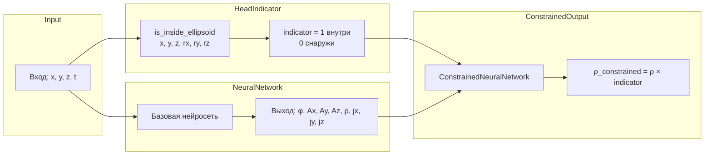

# План: Добавление ограничения плотности заряда внутри головы

## Цель

Добавить ограничение, что плотность заряда `ρ` (rho) должна быть ненулевой только внутри головы (эллипсоида). Для этого:
1. Использовать существующую функцию `step_indicator` из PML.jl как основу
2. Создать индикаторную функцию для проверки нахождения точки внутри эллипсоида
3. Интегрировать это ограничение в выход нейросети

## Технические детали

### Параметры эллипсоида (из eeg_data_generator.py)

```python
dimensions = {
    "child": {"rx": 7.0, "ry": 8.0, "rz": 9.0},
    "adult": {"rx": 8.5, "ry": 9.5, "rz": 10.5},  # По умолчанию в ноутбуке
    "large_adult": {"rx": 9.5, "ry": 10.5, "rz": 11.5},
    "female": {"rx": 8.0, "ry": 9.0, "rz": 10.0},
    "male": {"rx": 9.0, "ry": 10.0, "rz": 11.0},
}
```

По умолчанию (head_type="adult"): **rx=8.5, ry=9.5, rz=10.5**

### Текущее состояние
- Функция `step_indicator(x, x0)` в PML.jl: возвращает 0 если x < x0, 1 если x > x0
- Уравнения PDE в PDEDefinitions.jl: 8 переменных (φ, Ax, Ay, Az, ρ, jx, jy, jz)
- Нейросеть в NeuralNetwork.jl: выход 8 или 24 значения

### Архитектура решения



## Задачи

### 1. Создать функцию is_inside_ellipsoid

**Файл:** `src/neural_pde_solver/PML.jl`

**Описание:** Создать GPU-дружественную функцию для проверки, находится ли точка внутри эллипсоида с центром в начале координат и радиусами rx, ry, rz.

**Формула:** Точка (x, y, z) внутри эллипсоида если:
```
(x/rx)² + (y/ry)² + (z/rz)² <= 1
```

**Реализация:**
```julia
"""
    is_inside_ellipsoid(x, y, z, rx, ry, rz)

GPU-дружественная функция для проверки нахождения точки внутри эллипсоида.
Возвращает 1.0f0 если точка внутри, 0.0f0 если снаружи.
"""
function is_inside_ellipsoid(x, y, z, rx::Real, ry::Real, rz::Real)
    # Нормализованные координаты
    rx_f, ry_f, rz_f = Float32(rx), Float32(ry), Float32(rz)
    nx = x / rx_f
    ny = y / ry_f
    nz = z / rz_f
    # Проверка: сумма квадратов <= 1
    dist_squared = nx*nx + ny*ny + nz*nz
    return step_indicator(1.0f0 - dist_squared, 0.0f0)
end
```

### 2. Добавить структуру HeadConfig

**Файл:** `src/neural_pde_solver/PML.jl` (расширение)

**Описание:** Структура для хранения параметров головы (эллипсоида).

**Параметры по умолчанию:** rx=8.5f0, ry=9.5f0, rz=10.5f0 (модель "adult")

**Структура:**
```julia
struct HeadConfig
    rx::Float32  # Радиус по x
    ry::Float32  # Радиус по y  
    rz::Float32  # Радиус по z
    enabled::Bool
    
    function HeadConfig(; rx::Float32 = 8.5f0, ry::Float32 = 9.5f0, rz::Float32 = 10.5f0, enabled::Bool = true)
        @assert rx > 0 && ry > 0 && rz > 0 "Радиусы должны быть положительными"
        new(rx, ry, rz, enabled)
    end
end
```

### 3. Создать обёртку ConstrainedNeuralNetwork

**Файл:** `src/neural_pde_solver/NeuralNetwork.jl`

**Описание:** Обертка для базовой нейросети, которая применяет индикаторную функцию к выходу ρ (плотность заряда).

**Индексы переменных (из PDEDefinitions.jl):**
- 1: φ (потенциал)
- 2: Ax
- 3: Ay
- 4: Az
- 5: ρ (плотность заряда) ← ограничиваем
- 6: jx
- 7: jy
- 8: jz

**Структура:**
```julia
struct ConstrainedNeuralNetwork{NN, HC}
    network::NN
    head_config::HC
end

# Интерфейс: та же сигнатура что и у базовой сети
function (nn::ConstrainedNeuralNetwork)(x, y, z, t)
    # Получаем выход базовой сети
    output = nn.network(x, y, z, t)
    
    # Вычисляем индикатор (только если ограничение включено)
    if nn.head_config.enabled
        indicator = is_inside_ellipsoid(x, y, z, 
            nn.head_config.rx, nn.head_config.ry, nn.head_config.rz)
        
        # Применяем ограничение: ρ = 0 вне головы
        # Индекс ρ - 5
        output = map(output) do val, idx
            idx == 5 ? val * indicator : val
        end
    end
    
    return output
end
```

### 4. Интегрировать в Optimization.jl

**Файл:** `src/neural_pde_solver/Optimization.jl`

**Описание:** Добавить параметр `head_config` в функции оптимизации.

**Изменения:**
- Добавить опциональный параметр `head_config` в `run_eeg_inverse_problem`
- Обернуть нейросеть в `ConstrainedNeuralNetwork` если `head_config.enabled == true`

### 5. Написать тесты

**Файл:** `test_head_constraint.jl`

**Тесты:**
- Проверка `is_inside_ellipsoid`: точка в центре = 1, точка далеко = 0
- Проверка `ConstrainedNeuralNetwork`: ρ = 0 вне головы
- Градиентный тест: убедиться, что градиенты протекают через индикатор

## Файлы для изменения

| Файл | Изменение |
|------|-----------|
| `src/neural_pde_solver/PML.jl` | Добавить `is_inside_ellipsoid`, `HeadConfig` |
| `src/neural_pde_solver/NeuralNetwork.jl` | Добавить ConstrainedNeuralNetwork |
| `src/neural_pde_solver/Optimization.jl` | Обновить для использования ограничений |
| `src/neural_pde_solver/InverseProblem.jl` | Возможно обновить для передачи head_config |

## Вопросы для уточнения

1. **Применять ли ограничение также к плотности тока j (jx, jy, jz)?**
   - Да, ток также должен быть внутри головы
   - Нет, только ρ (плотность заряда)

2. **Как обрабатывать градиенты?**
   - Использовать straight-through estimator (игнорировать градиент через indicator)
   - Или позволить градиентам протекать (может быть проблематично из-за разрыва)
