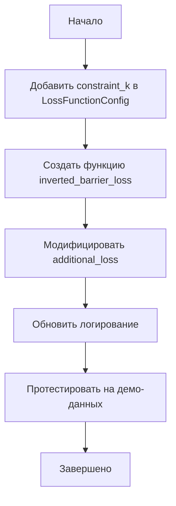

# План реализации инвертированного барьера для L_data

## Цель

Преобразовать функцию потерь `L_data` в **ограничение (constraint)** вместо стандартного MSE-лосса. Требования:
- При выполнении ограничения (маленькая ошибка) → слабое влияние на градиент
- При нарушении ограничения (большая ошибка) → превалирует над всеми остальными лоссами

## Выбранная функция

**Инвертированный барьер**: `L = 1 / (1 + exp(-k * MSE))`

где:
- `MSE` — среднеквадратичная ошибка по всем точкам
- `k` — параметр чувствительности (чем больше k, тем "жёстче" ограничение)

### Свойства функции:
| MSE | L (барьер) | Поведение |
|-----|------------|----------|
| → 0 | → 0 | Ограничение выполняется, градиент ~0 |
| = 1/k | = 0.5 | Точка перегиба |
| → ∞ | → 1 | Ограничение нарушено, градиент максимален |

## План реализации

### 1. Добавить параметр `constraint_k` в LossFunctionConfig

**Файл**: [`src/neural_pde_solver/Optimization.jl`](src/neural_pde_solver/Optimization.jl)

Добавить новое поле в структуру `LossFunctionConfig`:
```julia
constraint_k::Float64  # Параметр чувствительности для инвертированного барьера (по умолчанию: 10.0)
```

### 2. Создать функцию `inverted_barrier_loss`

**Файл**: [`src/neural_pde_solver/Optimization.jl`](src/neural_pde_solver/Optimization.jl)

```julia
"""
    inverted_barrier_loss(mse::T, k::T) where T <: Real

Вычисляет инвертированный барьер: L = 1 / (1 + exp(-k * MSE))

# Свойства:
- При MSE → 0: L → 0, градиент → 0 (ограничение выполняется)
- При MSE → ∞: L → 1, градиент → k/4 (ограничение нарушено)
"""
function inverted_barrier_loss(mse::T, k::T) where T <: Real
    return one(T) / (one(T) + exp(-k * mse))
end
```

### 3. Модифицировать `additional_loss`

**Файл**: [`src/neural_pde_solver/Optimization.jl`](src/neural_pde_solver/Optimization.jl)

В функции `additional_loss` заменить стандартный MSE на барьер-функцию:
```julia
# Внутри additional_loss:
mse = data_loss(phi_pred_fun, θ_gpu, coords_gpu, values_gpu, n_points)

# Применяем инвертированный барьер
barrier_loss = inverted_barrier_loss(mse, constraint_k)

# Используем барьер как "мягкое" ограничение
lambda_detached = Zygote.dropgrad(lambda_data_ref[])
result = barrier_loss * lambda_detached
```

### 4. Обновить логирование

**Файл**: [`src/neural_pde_solver/Optimization.jl`](src/neural_pde_solver/Optimization.jl)

Добавить логирование промежуточных значений:
```julia
log_value(logger, "Loss/L_data_MSE", mse; step=iter)           # "Сырой" MSE
log_value(logger, "Loss/L_data_Barrier", barrier_loss; step=iter)  # Барьер-лосс
log_value(logger, "Loss/L_data_Weighted", barrier_loss * lambda_data_ref[]; step=iter)
log_value(logger, "Params/constraint_k", constraint_k; step=iter)
```

## График работы



## Параметры по умолчанию

| Параметр | Рекомендуемое значение | Описание |
|----------|------------------------|----------|
| `constraint_k` | 10.0 | Умеренная чувствительность |
| `constraint_k` | 50.0 | Высокая чувствительность (жёстче) |
| `constraint_k` | 1.0 | Низкая чувствительность (мягче) |

## Пример использования

```julia
loss_config = LossFunctionConfig(
    lambda_data_init=1.0,
    constraint_k=10.0,  # Новий параметр
    # ... остальные параметры
)
```

## Мониторинг во время обучения

При правильной работе должны наблюдаться:
1. **Начальная фаза**: `L_data_MSE` высокое → `L_data_Barrier` близко к 1 → сильный градиент
2. **Фаза обучения**: `L_data_MSE` уменьшается → `L_data_Barrier` уменьшается
3. **Финальная фаза**: `L_data_MSE` мало → `L_data_Barrier` близко к 0 → слабый градиент, PDE/BC лоссы доминируют

## Файлы для модификации

1. `src/neural_pde_solver/Optimization.jl` — основные изменения
2. `src/neural_pde_solver/InverseProblem.jl` — при необходимости обновить документацию
