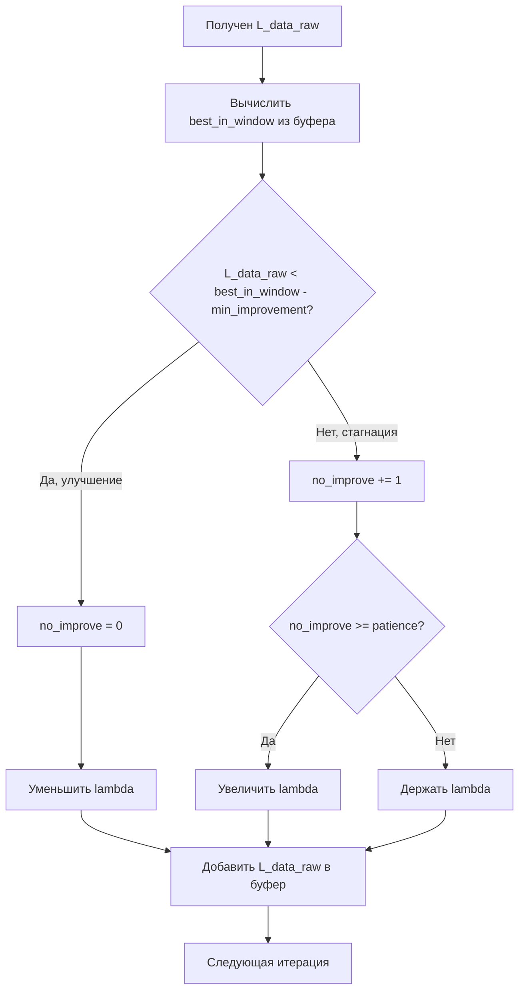

# План исправления: Счётчик шагов без улучшения data_loss

## Описание проблемы

В файле [`Optimization.jl`](../src/neural_pde_solver/Optimization.jl:333-368) обнаружена логическая ошибка в алгоритме адаптивного планировщика лямбды.

### Симптомы
Из логов видно:
- `Data` (реальный data_loss) постоянно уменьшается: 3.906 → 0.832
- Но `λ` (лямбда) постоянно растёт: 1.0 → 55.5

### Корневая причина

В текущей реализации (строки 334-349):

```julia
data_buffer[buffer_pos[]] = L_data_raw      # 1. Добавляем в буфер
buffer_pos[] = (buffer_pos[] % length(data_buffer)) + 1
best_in_window = minimum(data_buffer)        # 2. Вычисляем минимум ПОСЛЕ добавления

if L_data_raw < best_in_window - min_improvement  # 3. Сравниваем
    no_improve[] = 0
else
    no_improve[] += 1  # Всегда выполняется!
end
```

**Проблема**: Текущее значение `L_data_raw` добавляется в буфер **ДО** вычисления `best_in_window`. 

Когда `L_data_raw` является новым минимумом:
1. `data_buffer` теперь содержит `L_data_raw`
2. `best_in_window = minimum(data_buffer) = L_data_raw`
3. Условие `L_data_raw < best_in_window - min_improvement` становится `L_data_raw < L_data_raw - min_improvement`
4. Это условие **никогда не выполняется** (значение не может быть меньше самого себя)
5. Счётчик `no_improve[]` всегда увеличивается

## Решение

Вычислять `best_in_window` **ДО** добавления текущего значения в буфер:

```julia
# 1. Сначала вычисляем лучший результат из ПРЕДЫДУЩИХ значений
best_in_window = minimum(data_buffer)

# 2. Проверяем улучшение
if L_data_raw < best_in_window - min_improvement
    no_improve[] = 0
    lambda_data_new = lambda_data_ref[] * decrease_factor
    lambda_action[] = -1
else
    no_improve[] += 1
    lambda_action[] = 0
end

# 3. Только ПОСЛЕ проверки добавляем в буфер
data_buffer[buffer_pos[]] = L_data_raw
buffer_pos[] = (buffer_pos[] % length(data_buffer)) + 1
```

## Диаграмма алгоритма



## Изменения в коде

### Файл: `src/neural_pde_solver/Optimization.jl`

Заменить строки 334-356:

**Было:**
```julia
if length(data_buffer) > 0
    data_buffer[buffer_pos[]] = L_data_raw
    buffer_pos[] = (buffer_pos[] % length(data_buffer)) + 1
    # best observed in window
    best_in_window = minimum(data_buffer)

    # if current is significantly better than best -> improvement
    if L_data_raw < best_in_window - min_improvement
        no_improve[] = 0
        # optionally decrease lambda slightly to allow flexibility
        lambda_data_new = lambda_data_ref[] * decrease_factor
        lambda_action[] = -1
    else
        no_improve[] += 1
        lambda_action[] = 0
    end

    # If stagnated for enough consecutive iterations -> increase lambda
    if no_improve[] >= patience
        lambda_data_new = lambda_data_ref[] * increase_factor
        no_improve[] = 0
        lambda_action[] = 1
    end
    ...
```

**Станет:**
```julia
if length(data_buffer) > 0
    # best observed in window BEFORE adding current value
    best_in_window = minimum(data_buffer)

    # if current is significantly better than best -> improvement
    if L_data_raw < best_in_window - min_improvement
        no_improve[] = 0
        # optionally decrease lambda slightly to allow flexibility
        lambda_data_new = lambda_data_ref[] * decrease_factor
        lambda_action[] = -1
    else
        no_improve[] += 1
        lambda_action[] = 0
    end

    # If stagnated for enough consecutive iterations -> increase lambda
    if no_improve[] >= patience
        lambda_data_new = lambda_data_ref[] * increase_factor
        no_improve[] = 0
        lambda_action[] = 1
    end

    # Add current value to buffer AFTER checking for improvement
    data_buffer[buffer_pos[]] = L_data_raw
    buffer_pos[] = (buffer_pos[] % length(data_buffer)) + 1
    ...
```

## Ожидаемый результат

После исправления:
- При уменьшении `data_loss` счётчик `no_improve` будет сбрасываться в 0
- Лямбда будет увеличиваться только при реальной стагнации `data_loss`
- Лямбда может уменьшаться при улучшении `data_loss` (опционально)
