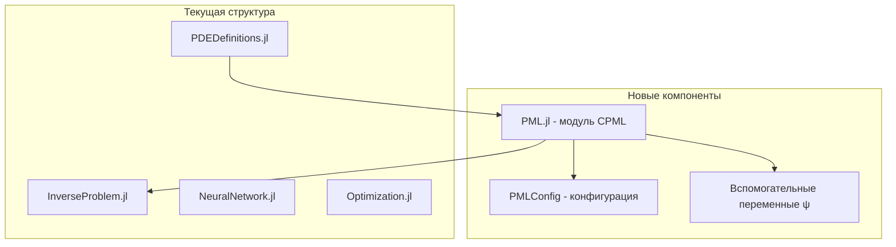
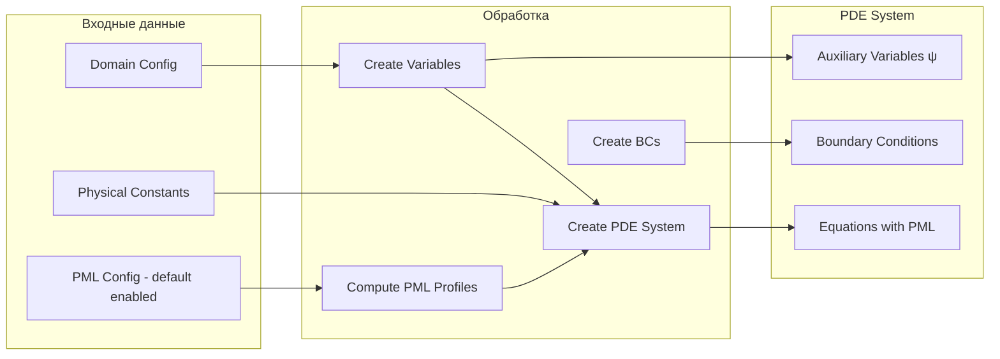

# План внедрения CPML для уравнений Максвелла через потенциалы

## 1. Обзор задачи

### Цель
Внедрить метод Perfectly Matched Layer (PML) для численной устойчивости и предотвращения отражения волн на границах расчётной области при решении уравнений Максвелла через потенциалы в калибровке Лоренца.

### Ключевые принципы реализации
- **PML включён по умолчанию** - стандартный способ решения
- **Единая функция** - модификация существующего `create_pde_system()` через опциональный параметр `pml_config`
- **Полная интеграция** - обновление Python интерфейса и экспериментов
- **Без фолбеков** - единая реализация без дублирования кода

### Выбранные параметры
- **Размер PML-слоя**: 10% от домена с каждой стороны
- **Профиль поглощения**: Полиномиальный (m=3)
- **Тип PML**: CPML (Convolutional PML) с параметрами σ, κ, α

---

## 2. Математическая формулировка CPML

### 2.1 Профили поглощения

Для PML-слоя толщиной D с полиномиальным профилем степени m=3:

```
σ_x(d) = σ_max * (d/D)^m
κ_x(d) = 1 + (κ_max - 1) * (d/D)^m  
α_x(d) = α_max * (1 - d/D)
```

где d — расстояние от границы внутренней области до точки в PML.

Рекомендуемые значения:
- σ_max = (m+1) * c / (D * 40)  (оптимальное поглощение)
- κ_max = 7-10 (растяжение координат)
- α_max = 0.05-0.5 (устойчивость на низких частотах)

### 2.2 Модифицированные волновые уравнения

Для скалярного потенциала φ:

```
(1/c²) * ∂²φ/∂t² = ∂/∂x( (1/κ_x) * ∂φ/∂x + ψ_φx ) 
                 + ∂/∂y( (1/κ_y) * ∂φ/∂y + ψ_φy )
                 + ∂/∂z( (1/κ_z) * ∂φ/∂z + ψ_φz )
                 - ρ/ε₀
```

Эволюция вспомогательных полей:

```
∂ψ_φx/∂t = -(σ_x/κ_x + α_x) * ψ_φx + (σ_x/κ_x²) * ∂φ/∂x
```

Аналогично для компонент векторного потенциала A_x, A_y, A_z.

---

## 3. Архитектура решения



---

## 4. Детальный план реализации

### 4.1 Создать модуль `src/neural_pde_solver/PML.jl`

**Структура модуля:**

```julia
module PML

using ModelingToolkit: @parameters, @variables, Differential

# Экспорты
export PMLConfig, create_pml_variables, compute_pml_profiles
export apply_pml_to_dalembert, create_pml_auxiliary_equations
export default_pml_config

# Конфигурация PML - ВКЛЮЧЁН ПО УМОЛЧАНИЮ
struct PMLConfig
    pml_thickness_ratio::Float64  # 0.1 = 10%
    polynomial_order::Int         # m = 3
    sigma_max::Float64
    kappa_max::Float64
    alpha_max::Float64
    enabled::Bool                 # true по умолчанию
end

# Конструктор по умолчанию - PML включён
function default_pml_config()
    return PMLConfig(
        pml_thickness_ratio = 0.1,
        polynomial_order = 3,
        sigma_max = 0.0,  # Будет вычислен автоматически
        kappa_max = 7.0,
        alpha_max = 0.1,
        enabled = true
    )
end

# Функции профиля
function sigma_profile(d, D, sigma_max, m)
    return sigma_max * (d / D)^m
end

function kappa_profile(d, D, kappa_max, m)
    return 1.0 + (kappa_max - 1.0) * (d / D)^m
end

function alpha_profile(d, D, alpha_max)
    return alpha_max * (1.0 - d / D)
end

# Создание вспомогательных переменных
function create_pml_variables()
    # ψ_φx, ψ_φy, ψ_φz для скалярного потенциала
    # ψ_Aix, ψ_Aiy, ψ_Aiz для каждой компоненты A
end

# Применение PML к оператору Даламбера
function apply_pml_to_dalembert(F, params, constants, variables, pml_config)
    # Модифицированный оператор с PML
end

end # module
```

### 4.2 Модифицировать `PDEDefinitions.jl`

**Изменения:**

1. Добавить импорт модуля PML
2. Расширить структуру `VariableSet` для включения вспомогательных переменных ψ
3. **Модифицировать существующий `create_pde_system()`** - добавить опциональный параметр `pml_config`
4. Модифицировать граничные условия для PML-области

**Сигнатура функции:**

```julia
function create_pde_system(
    constants::NamedTuple,
    variables::VariableSet,
    bcs::Vector,
    domains::Vector;
    pml_config::Union{PMLConfig, Nothing} = default_pml_config()
)
    # Если pml_config.enabled == true - применяем PML
    # Если pml_config === nothing или enabled == false - обычные уравнения
end
```

**Новые переменные:**

```julia
# Вспомогательные поля для φ
@variables ψ_φx(..), ψ_φy(..), ψ_φz(..)

# Вспомогательные поля для A_x, A_y, A_z
@variables ψ_Axx(..), ψ_Axy(..), ψ_Axz(..)
@variables ψ_Ayx(..), ψ_Ayy(..), ψ_Ayz(..)
@variables ψ_Azx(..), ψ_Azy(..), ψ_Azz(..)
```

### 4.3 Обновить `InverseProblem.jl`

**Изменения:**

1. Добавить параметр `pml_config` в `create_complete_setup()`
2. Передавать PML-конфигурацию при создании PDE системы
3. Обновить анализ результатов для учёта PML-слоя

### 4.4 Обновить Python интерфейс `julia_interface.py`

**Изменения в классе `EEGInverseSolver`:**

```python
@dataclass
class PMLConfig:
    """Конфигурация PML для поглощающих граничных условий"""
    pml_thickness_ratio: float = 0.1
    polynomial_order: int = 3
    sigma_max: float = 0.0  # Авто-вычисление
    kappa_max: float = 7.0
    alpha_max: float = 0.1
    enabled: bool = True  # PML включён по умолчанию

class EEGInverseSolver:
    def __init__(
        self,
        # ... существующие параметры ...
        pml_config: Optional[PMLConfig] = None  # По умолчанию создастся с enabled=True
    ):
        if pml_config is None:
            pml_config = PMLConfig()  # PML включён по умолчанию
        self.pml_config = pml_config
```

### 4.5 Граничные условия

**Внутренняя область (σ=0, κ=1, α=0):**
- Обычные волновые уравнения
- Калибровка Лоренца сохраняется

**PML-слой:**
- Модифицированные уравнения с вспомогательными полями
- На внешней границе: φ=0, A=0 (волны уже затухли)

---

## 5. Структура файлов

```
src/neural_pde_solver/
├── __init__.py
├── PML.jl              # НОВЫЙ: модуль CPML
├── PDEDefinitions.jl   # ИЗМЕНЁН: добавлена поддержка PML в create_pde_system
├── InverseProblem.jl   # ИЗМЕНЁН: интеграция PML config
├── NeuralNetwork.jl
└── Optimization.jl

src/inverse_npde/
├── julia_interface.py  # ИЗМЕНЁН: добавлен PMLConfig
└── eeg_data_generator.py

examples/
└── eeg_realistic_demo.ipynb  # ИЗМЕНЁН: использование PML по умолчанию
```

---

## 6. Тестирование

### 6.1 Юнит-тесты для PML.jl

- Тест функций профиля (σ, κ, α)
- Тест создания вспомогательных переменных
- Тест модифицированного оператора Даламбера

### 6.2 Интеграционные тесты

- Сравнение решения с/без PML
- Проверка затухания волн в PML-слое
- Валидация калибровки Лоренца в основной области

---

## 7. Пример использования

### Julia

```julia
using .PML
using .PDEDefinitions

# PML включён по умолчанию - конфигурация не обязательна
pde_system = create_pde_system(constants, variables, bcs, domains)

# Или с кастомной конфигурацией
pml_config = PMLConfig(
    pml_thickness_ratio = 0.15,  # 15% от домена
    polynomial_order = 3,
    sigma_max = 0.5,
    kappa_max = 10.0,
    alpha_max = 0.2,
    enabled = true
)
pde_system = create_pde_system(constants, variables, bcs, domains; pml_config=pml_config)

# Отключить PML (если нужно)
pml_config_disabled = PMLConfig(enabled=false)
pde_system = create_pde_system(constants, variables, bcs, domains; pml_config=pml_config_disabled)
```

### Python

```python
from inverse_npde import EEGInverseSolver, PMLConfig

# PML включён по умолчанию
solver = EEGInverseSolver()

# Или с кастомной конфигурацией
pml_config = PMLConfig(
    pml_thickness_ratio=0.15,
    kappa_max=10.0
)
solver = EEGInverseSolver(pml_config=pml_config)

# Отключить PML
solver = EEGInverseSolver(pml_config=PMLConfig(enabled=False))
```

---

## 8. Диаграмма потока данных



---

## 9. Риски и митигация

| Риск | Митигация |
|------|-----------|
| Увеличение числа переменных (12 вспомогательных полей) | Оптимизация памяти, GPU-ускорение |
| Нарушение калибровки Лоренца в PML | Мониторинг калибровки в основной области |
| Неустойчивость при больших σ | Плавный профиль, параметр α |
| Сложность отладки | Детальное логирование, визуализация профилей |

---

## 10. Todo список

- [x] Изучить текущую структуру проекта и PDEDefinitions.jl
- [x] Уточнить параметры PML у пользователя
- [ ] Создать модуль PML.jl с CPML реализацией
- [ ] Добавить структуру PMLConfig (по умолчанию enabled=true)
- [ ] Реализовать функции профилей поглощения (σ, κ, α)
- [ ] Создать вспомогательные переменные ψ_φ и ψ_A для CPML
- [ ] Модифицировать существующий create_pde_system - добавить опциональный pml_config
- [ ] Добавить граничные условия для PML-области
- [ ] Обновить Python интерфейс julia_interface.py - добавить PMLConfig
- [ ] Обновить InverseProblem.jl для передачи PML конфигурации
- [ ] Обновить эксперимент eeg_realistic_demo.ipynb для использования PML
- [ ] Создать тесты для валидации PML
- [ ] Обновить документацию
