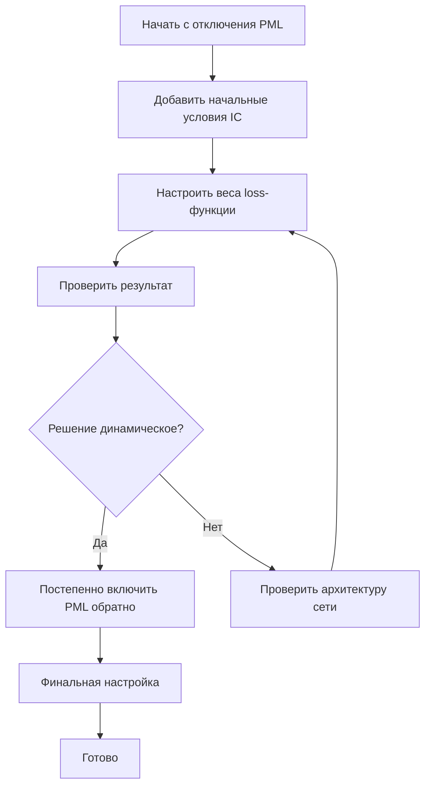

# Анализ проблемы стационарного решения в PINN для обратной задачи ЭЭГ

## Корневые причины проблемы

После детального анализа кода в [`src/neural_pde_solver/PDEDefinitions.jl`](src/neural_pde_solver/PDEDefinitions.jl) были выявлены **три основные причины** почему решение получается стационарным по времени:

### 1. Отсутствие начальных условий (IC) — ГЛАВНАЯ ПРИЧИНА 🔴

**Проблема:** Волновое уравнение является уравнением **второго порядка по времени** и требует **двух начальных условий**:
- φ(x,y,z, t=0) = f(x,y,z) — начальное распределение потенциала
- ∂φ/∂t(x,y,z, t=0) = g(x,y,z) — начальная скорость изменения

**Текущее состояние:** В файле [`PDEDefinitions.jl`](src/neural_pde_solver/PDEDefinitions.jl:234) функция `create_boundary_conditions()` определяет только **пространственные граничные условия** (φ=0 на границах x, y, z), но **НЕТ условий при t=0**.

**Код (строки 243-272):**
```julia
# Есть только пространственные границы:
variables.φ(x_min, variables.y, variables.z, variables.t) ~ 0.0,
variables.φ(x_max, variables.y, variables.z, variables.t) ~ 0.0,
# ... и т.д.
```

**Нет временных границ:**
- `φ(x,y,z, t=t_min) ~ ...` — отсутствует
- `∂φ/∂t(x,y,z, t=t_min) ~ ...` — отсутствует

**Следствие:** У PDE бесконечное множество решений, и нейросеть может выбрать тривиальное стационарное решение φ≈const, которое минимизирует все члены уравнения.

---

### 2. Слишком агрессивные параметры PML 🟡

**Проблема:** PML (Perfectly Matched Layer) добавляет члены затухания в волновое уравнение:
- γ * ∂φ/∂t — вязкое затухание
- α * φ — статическое экранирование

**Текущая конфигурация по умолчанию в [`src/neural_pde_solver/PML.jl`](src/neural_pde_solver/PML.jl:73):**
```julia
PMLConfig(;
    pml_thickness_ratio = 0.1,      # 10% толщина слоя
    reflection_coefficient = 1e-4,
    characteristic_frequency = 40.0, # Гц
    profile_order = 2,
    enabled = true                   # Включён по умолчанию
)
```

**Автоматически вычисляемые значения (строки 146-147):**
```julia
gamma_max = π * f_char * (m+1) * ln(1/R)
# При f_char=40, m=2, R=1e-4: gamma_max ≈ 8680
```

**Следствие:** Очень большое значение gamma_max приводит к экспоненциальному затуханию решения во времени, фактически превращая волновое уравнение в уравнение диффузионного типа.

---

### 3. Spectral Bias нейросетей 🟡

**Проблема:** Нейросети естественным образом учат низкочастотные компоненты быстрее высокочастотных. Без должной инициализации и стимуляции сеть предпочитает стационарные решения.

**Текущая архитектура (по умолчанию):**
- Скрытые слои: [32, 32]
- Входы: 4 (x, y, z, t)
- Выходы: 8 (φ, A_x, A_y, A_z, ρ, j_x, j_y, j_z)

---

## Рекомендации по исправлению

### Приоритет 1: Добавить начальные условия (CRITICAL)

Необходимо модифицировать [`create_boundary_conditions()`](src/neural_pde_solver/PDEDefinitions.jl:234) для ЭЭГ-задачи:

```julia
# Добавить в массив bcs:
# Начальное распределение потенциала (из данных или нулевое)
variables.φ(variables.x, variables.y, variables.z, t_min) ~ measured_phi_at_t0,
# Начальная скорость (производная по времени)
Differential(variables.t)(variables.φ(variables.x, variables.y, variables.z, variables.t))(t=t_min) ~ 0.0,
```

**Варианты для ЭЭГ:**
1. Если известно начальное состояние — использовать его как IC
2. Если нет — использовать нулевую начальную скорость и экстраполировать φ(t=0) из данных
3. Добавить IC как дополнительные обучаемые параметры (learnable IC)

---

### Приоритет 2: Настроить или отключить PML

**Вариант А — Отключить PML для отладки:**
```julia
pml_config = PMLConfig(enabled = false)
```

**Вариант Б — Уменьшить gamma_max:**
```julia
pml_config = PMLConfig(;
    gamma_max = 1.0,    # Значительно меньше чем auto (~8680)
    alpha_max = 0.1,
    enabled = true
)
```

**Вариант В — Использовать PML только на границах (текущая реализация корректна):**
Но уменьшить characteristic_frequency для ЭЭГ-данных:
```julia
pml_config = PMLConfig(;
    characteristic_frequency = 10.0, # Для ЭЭГ достаточно 10 Гц
    enabled = true
)
```

---

### Приоритет 3: Усилить временную динамику в loss-функции

Рекомендуется отказаться от настройки устаревшего параметра вручную и вместо этого
использовать `lambda_data_init` вместе с improvement-based планировщиком (`lambda_schedule`).

Пример конфигурации для усиления веса данных и активации планировщика:

```julia
LossFunctionConfig(;
    lambda_pde = 0.1,           # Уменьшить вес PDE
    lambda_bc = 1.0,
    lambda_data_init = 100.0,   # Начальное значение λ для планировщика
    lambda_min = 1.0,
    lambda_max = 1e5,
    lambda_schedule_type = :improvement,
    lambda_schedule = Dict("window_size" => 10, "patience" => 3, "increase_factor" => 1.25)
)
```

Этот подход даёт контролируемое увеличение веса данных при стагнации `L_data_raw`, вместо жёсткой цели по фиксированному соотношению между data loss и PDE loss.

---

### Приоритет 4: Улучшить архитектуру сети для временных рядов

1. **Добавить sinusoidal positional encoding для времени:**
```julia
# В архитектуре:
t_encoded = sin.(π * t / T_max), cos.(π * t / T_max), ...
```

2. **Использоватьavier инициализацию для временных весов**

3. **Увеличить ширину сети для捕捉 высокочастотных компонент**

---

### Приоритет 5: Стратегия сэмплирования

Текущая стратегия QuasiRandomTraining может недостаточно сэмплировать временную область. Проверить распределение точек по времени:

```julia
# Рекомендуется равномерное сэмплирование по всем временным точкам
# где есть измеренные данные
```

---

## План реализации



---

## Ключевые файлы для модификации

| Файл | Изменение |
|------|-----------|
| [`src/neural_pde_solver/PDEDefinitions.jl`](src/neural_pde_solver/PDEDefinitions.jl:234) | Добавить IC в `create_boundary_conditions()` |
| [`src/neural_pde_solver/InverseProblem.jl`](src/neural_pde_solver/InverseProblem.jl:14) | Настроить PML и loss конфигурацию |
| [`src/neural_pde_solver/Optimization.jl`](src/neural_pde_solver/Optimization.jl:80) | Возможно, изменить параметры по умолчанию |

---

## Резюме

**Главная причина:** Отсутствие начальных условий (IC) в PDE-системе. Волновое уравнение без IC имеет бесконечное количество решений, и нейросеть выбирает тривиальное стационарное решение.

**Решение:** Добавить начальные условия для φ и ∂φ/∂t при t=t_min в функцию `create_boundary_conditions()`.

**Дополнительные меры:** 
- Уменьшить или отключить PML
- Увеличить вес data loss
- Улучшить архитектуру сети для временных рядов
