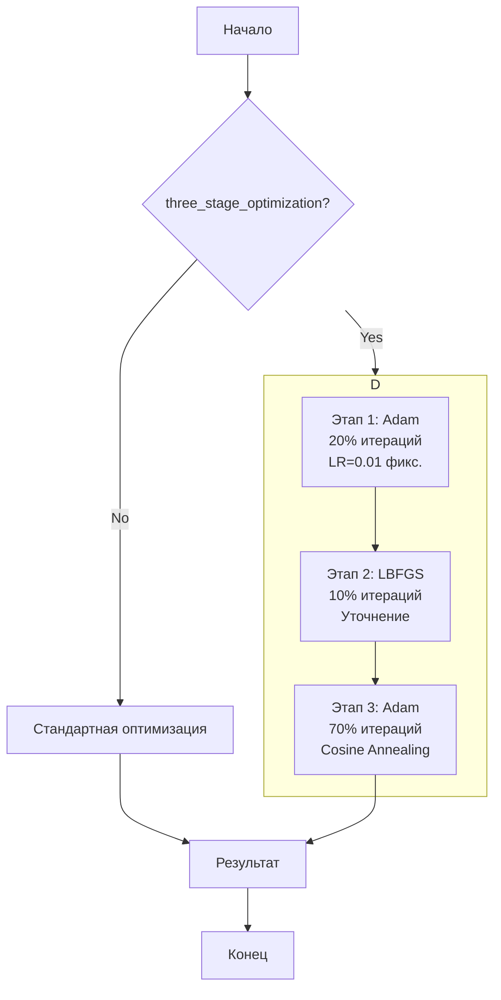

# План: TV + L1 регуляризация и трёхэтапная оптимизация

## Цель
Добавить в проект:
1. **Total Variation (TV) регуляризацию** на заряды ρ (для моделирования токовых диполей)
2. **L1 регуляризацию** на все веса нейросети
3. **Трёхэтапную оптимизацию**: Adam → LBFGS → Adam с scheduler

## Подход

### NeuralPDE + ручной scheduler через callback
Используем существующий в проекте подход - ручное управление LR через callback (как в текущем коде для lambda_data).

---

## Трёхэтапная оптимизация

### Структура

```
Этап 1: Adam (начальное обучение)
  ├── Цель: быстрая начальная сходимость
  ├── Learning rate: большой фиксированный (например, 0.01)
  ├── Итерации: ~20% от общего числа
  └── Регуляризация: TV + L1 активны

Этап 2: LBFGS (уточнение)
  ├── Цель: квазиньютоновское уточнение решения
  ├── Особенность: работает с полным градиентом
  ├── Итерации: ~10% от общего числа
  └── Регуляризация: TV + L1 активны

Этап 3: Adam с Scheduler (fine-tuning)
  ├── Цель: тонкая настройка с затухающим LR
  ├── Scheduler: Cosine Annealing
  ├── Итерации: ~70% от общего числа
  └── Регуляризация: TV + L1 активны
```

### Пропорциональное распределение итераций

```julia
# При total_iterations = 3000:
# adam1_iters = 600   (20%)
# lbfgs_iters = 300   (10%)
# adam2_iters = 2100  (70%)

adam1_ratio = 0.2   # 20% - начальное обучение
lbfgs_ratio = 0.1   # 10% - уточнение
adam2_ratio = 0.7   # 70% - fine-tuning

adam1_iters = max(100, floor(Int, total_iterations * adam1_ratio))
lbfgs_iters = max(50, floor(Int, total_iterations * lbfgs_ratio))
adam2_iters = total_iterations - adam1_iters - lbfgs_iters
```

---

## Этап 1: Расширение LossFunctionConfig

### Изменения в `src/neural_pde_solver/Optimization.jl`

**Новые поля в LossFunctionConfig:**

```julia
# Поля для TV регуляризации на заряды (rho)
lambda_tv::Float32                    # Вес TV регуляризации (default: 0.1)
tv_epsilon::Float32                   # Параметр сглаживания для TV (default: 1e-5)
num_tv_time_samples::Int               # Количество временных срезов для TV

# Поля для L1 регуляризации на веса
lambda_l1::Float32                     # Вес L1 регуляризации (default: 0.001)

# refs для хранения промежуточных значений
tv_loss_ref::Ref{NamedTuple}          # Ref для TV loss
l1_loss_ref::Ref{NamedTuple}          # Ref для L1 loss
```

---

## Этап 2: Реализация TV регуляризации

### Функция `compute_tv_regularization`

По аналогии с `compute_field_energy_loss`:

```julia
function compute_tv_regularization(phi_pred_fun, θ, measured_time, inner_lb, inner_ub, 
                                   tv_epsilon::T, num_tv_time_samples::Int=5, N_mc::Int=1000)
```

**Логика:**
1. Создать time_points на основе measured_time и num_tv_time_samples
2. Для каждой пространственной точки вычислить ρ (плотность заряда)
3. Вычислить градиент ∇ρ = (∂ρ/∂x, ∂ρ/∂y, ∂ρ/∂z)
4. TV = ∫√(|∇ρ|² + ε²) dV (сглаженная TV для дифференцируемости)
5. Использовать Monte Carlo интегрирование (как для energy field)

**Выход:** NamedTuple с полями:
- `TV`: Total Variation интеграл
- `TV_normalized`: TV на единицу объёма
- `L_tv`: Экспоненциальный лосс

---

## Этап 3: Реализация L1 регуляризации

### Функция `compute_l1_regularization`

```julia
function compute_l1_regularization(θ)
    # L1 = λ * Σ|w| по всем параметрам
    return lambda_l1 * sum(abs.(θ))
end
```

---

## Этап 4: Модификация create_additional_loss

Добавить вычисление TV и L1 в функцию потерь:

```julia
# Внутри additional_loss функции:

# L1 регуляризация (всегда вычисляем)
l1_val = sum(abs.(θ))
l1_loss_ref[] = (l1=l1_val,)
result = result + lambda_l1 * l1_val

# TV регуляризация (если включена)
if compute_tv
    tv_result = compute_tv_regularization(...)
    tv_loss_ref[] = (TV=tv_result.TV, TV_norm=tv_result.TV_normalized, L_tv=tv_result.L_tv)
    result = result + lambda_tv * tv_result.L_tv
end
```

---

## Этап 5: Реализация трёхэтапной оптимизации

### Основная функция в InverseProblem.jl

```julia
function run_three_stage_optimization(chain, ps, loss_config, opt_config, domain_config, total_iterations)
    # Пропорциональное распределение итераций
    adam1_ratio = 0.2
    lbfgs_ratio = 0.1
    adam2_ratio = 0.7
    
    adam1_iters = max(100, floor(Int, total_iterations * adam1_ratio))
    lbfgs_iters = max(50, floor(Int, total_iterations * lbfgs_ratio))
    adam2_iters = total_iterations - adam1_iters - lbfgs_iters
    
    @info "Трёхэтапная оптимизация: Adam($adam1_iters) → LBFGS($lbfgs_iters) → Adam($adam2_iters)"
    
    # === Этап 1: Adam (начальное обучение) ===
    @info "Этап 1: Adam (фиксированный LR = $(opt_config.adam1_lr))"
    opt_adam1 = OptimizationOptimisers.Adam(opt_config.adam1_lr)
    
    prob1 = OptimizationProblem(loss_func, ps, adtype=Grad())
    sol1 = solve(prob1, opt_adam1, maxiters=adam1_iters, callback=callback1)
    
    # === Этап 2: LBFGS (уточнение) ===
    @info "Этап 2: LBFGS"
    opt_lbfgs = OptimizationOptimJL.LBFGS()
    
    prob2 = OptimizationProblem(loss_func, sol1.u, adtype=Grad())
    sol2 = solve(prob2, opt_lbfgs, maxiters=lbfgs_iters, callback=callback2)
    
    # === Этап 3: Adam с Scheduler (fine-tuning) ===
    @info "Этап 3: Adam с Cosine Annealing"
    
    # Инициализация scheduler
    scheduler_state = Ref(0)
    current_lr = Ref(opt_config.adam2_lr)
    T_max = adam2_iters
    
    # Callback с обновлением LR
    callback3_with_scheduler = function(p, l)
        scheduler_state[] += 1
        t = scheduler_state[]
        
        # Cosine Annealing: lr = base_lr * 0.5 * (1 + cos(π * t/T_max))
        current_lr[] = opt_config.adam2_lr * 0.5f0 * (1.0f0 + cos(π * t / T_max))
        
        # Основной callback
        callback3(p, l)
        
        return false
    end
    
    opt_adam2 = OptimizationOptimisers.Adam(current_lr[])
    
    prob3 = OptimizationProblem(loss_func, sol2.u, adtype=Grad())
    sol3 = solve(prob3, opt_adam2, maxiters=adam2_iters, callback=callback3_with_scheduler)
    
    return sol3
end
```

---

## Этап 6: Планировщики LR (реализация вручную)

### Cosine Annealing

```julia
function cosine_annealing_lr(base_lr::Float32, t::Int, T_max::Int)::Float32
    return base_lr * 0.5 * (1.0 + cos(π * t / T_max))
end
```

### Warmup + Cosine

```julia
function warmup_cosine_lr(base_lr::Float32, t::Int, T_max::Int, warmup_iters::Int)::Float32
    if t <= warmup_iters
        # Linear warmup
        return base_lr * (t / warmup_iters)
    else
        # Cosine decay after warmup
        t_after_warmup = t - warmup_iters
        T_after_warmup = T_max - warmup_iters
        return base_lr * 0.5 * (1.0 + cos(π * t_after_warmup / T_after_warmup))
    end
end
```

---

## Этап 7: Расширение OptimizationConfig

### Новые поля

```julia
struct OptimizationConfig
    # Существующие поля...
    
    # Трёхэтапная оптимизация
    three_stage_optimization::Bool      # Включить трёхэтапную оптимизацию
    
    # LR для каждого этапа
    adam1_lr::Float32                   # LR для первого Adam (0.01)
    adam2_lr::Float32                   # LR для второго Adam (0.001)
    
    # Доли итераций (опционально, можно вычислять автоматически)
    adam1_ratio::Float32                 # 0.2
    lbfgs_ratio::Float32                # 0.1
    adam2_ratio::Float32                 # 0.7
    
    # Scheduler для финального этапа
    scheduler_type::Symbol               # :cosine, :warmup_cosine, :step
    scheduler_warmup::Int               # Warmup итерации (если нужно)
end
```

---

## Этап 8: Расширение callback логирования

```julia
# Логируем TV loss
if tv_loss_ref[] != nothing
    log_value(logger, "Loss/TV", tv_loss_ref[].TV; step=iter)
    log_value(logger, "Loss/L_tv", tv_loss_ref[].L_tv; step=iter)
    log_value(logger, "Loss/L_tv_weighted", tv_loss_ref[].L_tv * lambda_tv; step=iter)
end

# Логируем L1 loss
if l1_loss_ref[] != nothing
    log_value(logger, "Loss/L1", l1_loss_ref[].l1; step=iter)
    log_value(logger, "Loss/L1_weighted", l1_loss_ref[].l1 * lambda_l1; step=iter)
end

# Логируем текущий LR (для финального Adam этапа)
log_value(logger, "Params/current_lr", current_lr; step=iter)

# Логируем текущий этап
log_value(logger, "Params/current_stage", current_stage; step=iter)
```

---

## Этап 9: Обновление InverseProblem.jl

### Новые параметры функции

```julia
function run_eeg_inverse_problem(;
    # Существующие параметры...
    
    # TV регуляризация
    lambda_tv::Float32=0.1,
    tv_epsilon::Float32=1e-5,
    num_tv_time_samples::Int=5,
    
    # L1 регуляризация
    lambda_l1::Float32=0.001,
    
    # Трёхэтапная оптимизация
    three_stage_optimization::Bool=false,
    
    # LR для этапов
    adam1_lr::Float32=0.01,
    adam2_lr::Float32=0.001,
    
    # Scheduler
    scheduler_type::Symbol=:cosine,
    scheduler_warmup::Int=0
)
```

---

## Резюме изменений файлов

| Файл | Изменения |
|------|-----------|
| `src/neural_pde_solver/Optimization.jl` | Добавить TV/L1 поля в LossFunctionConfig, реализовать compute_tv_regularization, compute_l1_regularization, модифицировать create_additional_loss, расширить callback |
| `src/neural_pde_solver/InverseProblem.jl` | Добавить параметры для TV/L1/three-stage, реализовать run_three_stage_optimization |

---

## Параметры по умолчанию

### Регуляризация
- `lambda_tv = 0.1` - умеренная TV регуляризация
- `tv_epsilon = 1e-5` - сглаживание для дифференцируемости
- `lambda_l1 = 0.001` - легкая L1 регуляризация

### Трёхэтапная оптимизация (при total_iterations=3000)
- `adam1_lr = 0.01` - большой фиксированный LR
- `adam2_lr = 0.001` - LR для fine-tuning
- `adam1_iters = 600` (20%)
- `lbfgs_iters = 300` (10%)
- `adam2_iters = 2100` (70%)
- `scheduler_type = :cosine` - плавное затухание

---

## Mermaid диаграмма


